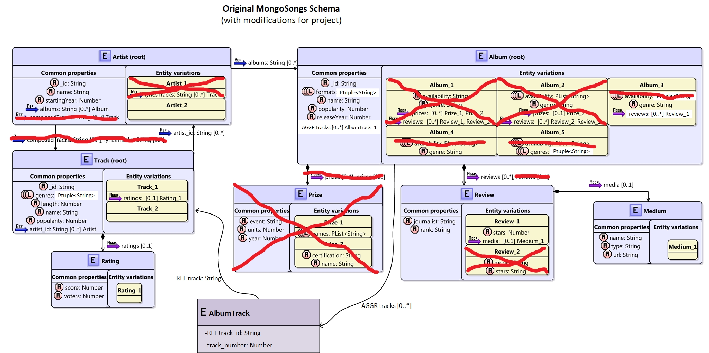
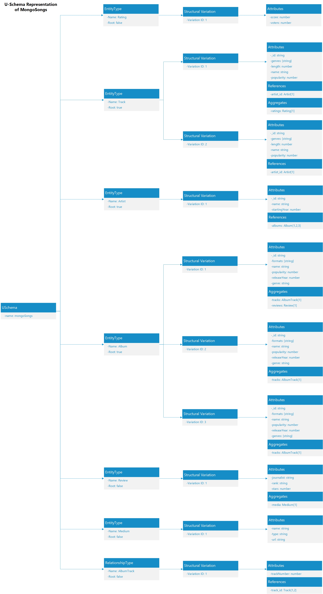
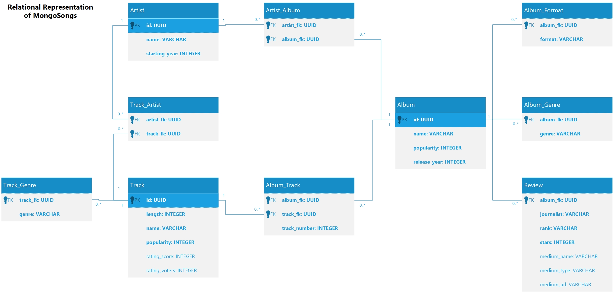
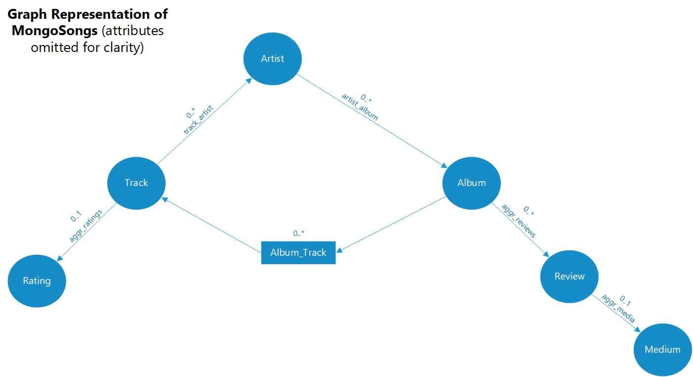

[(home)](https://beqpolk1.github.io/csci-592-spring2022/)

## Schema Overview

* For the purposes of the project, I chose to use the MongoSongs NoSQL schema provided in the [UM NoSQL Data Engineering repo](https://github.com/catedrasaes-umu/NoSQLDataEngineering)
    * For the sake of simplicity, [several adjustments](changes_to_model.md) were made to the schema
    
---

MongoSongs NoSQL Schema with Modifications

---
    
* The modified MongoSongs schema was translated, by hand to a U-Schema form, following the guidelines laid out by Candel et al. in [*A unified metamodel for NoSQL and relational databases*](https://www-sciencedirect-com.proxybz.lib.montana.edu/science/article/pii/S0306437921001149)

---

U-Schema Representation of MongoSongs Inferred from NoSQL Schema

---

* This U-Schema representation was then translated (again, by hand) to a relational form and a graph form for use with PostgreSQL and Neo4j

---

Relational Schema for MongoSongs Built from U-Schema Model

---

Graph Schema for MongoSongs Built from U-Schema Model

---

* Efforts were made to obtain relational and graph schemas that would result in the "same" U-Schema model as that obtained from the modified NoSQL schema
* However, "same" in this context is not well defined
    * This consideration points to some additional questions - what is equivalence for U-Schemas? Can it be used to tell if two database schemas are the same?
* Additional questions arose during the translation process:
    * The original paper by Candel et al. offers no guidance on how to reverse-map tuple or list attributes of U-Schema to features of a relational database. I took the "obvious" approach, where tuple or list values are represented as rows in an additional table with foreign keys linking back to the entity who has the property. (Note that this leads to a non-normalized representation for these attributes.)
    * The original paper doesn't offer guidance on how to reverse-map a reference of U-Schema to features of a graph database. Again, I took the "obvious" approach, where each reference is given a corresponding relationship type in the graph, with source and destination set appropriately. (Note that reverse engineering such a graph schema would lead to a *different* U-Schema model than the one originally used to define it.)
    * In general, Candel et al.'s original paper does not get into much detail for reverse-mapping U-Schema models to schemas for specific database paradigms. An interesting project could be to better define such reverse mappings, such that the operation of forward-mapping a specific schema to a U-Schema model, reverse mapping an additional schema from that model, and then performing another forward mapping would minimize translation artifacts.